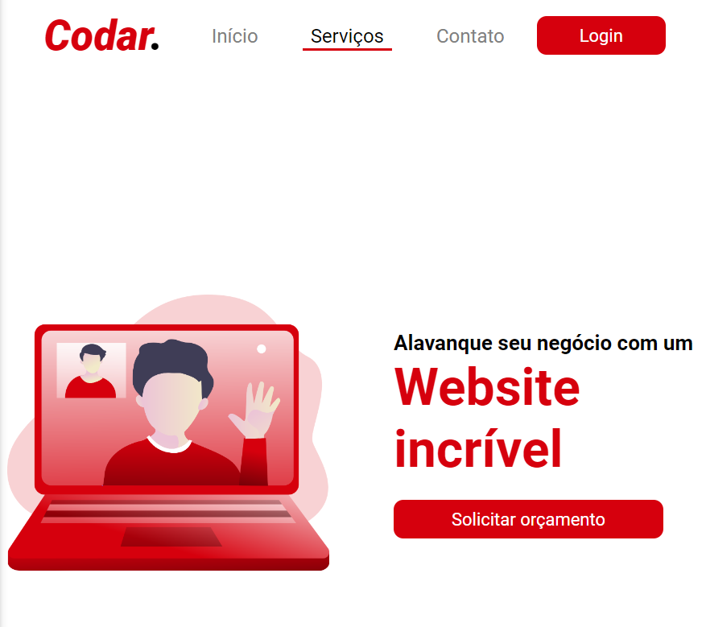

<h1>Projeto Codar</h1>

Este projeto foi o primeiro que desenvolvi baseado em um desafio do site <a href="https://devchallenge.vercel.app/">DevChallenge</a>. Gostei bastante do desafio e fiquei bastante entusiasmado para mergulhar em outros desafios do site para estar sempre praticando!

Como temos apenas imagens estáticas do site tive liberdade de usar um pouco a criatividade nos botões e menu do site utilizando pseudo-elementos como o <strong>:after</strong>.

Link do deploy: <a href="https://wbsantiago.github.io/codar-website/">https://wbsantiago.github.io/codar-website/</a>

--------------------------------------------------------------------

<h1>Codar Project</h1>

This project was the first one I developed based on a challenge from the . <a href="https://devchallenge.vercel.app/">DevChallenge website</a>. I really enjoyed the challenge and was really excited to dive into other challenges on the site to keep practicing!

As we only have static images of the site I was free to use a little creativity in the buttons and menu of the site using pseudo-elements such as <strong>:after</strong>.

Link of deploy: <a href="https://wbsantiago.github.io/codar-website/">https://wbsantiago.github.io/codar-website/</a>

